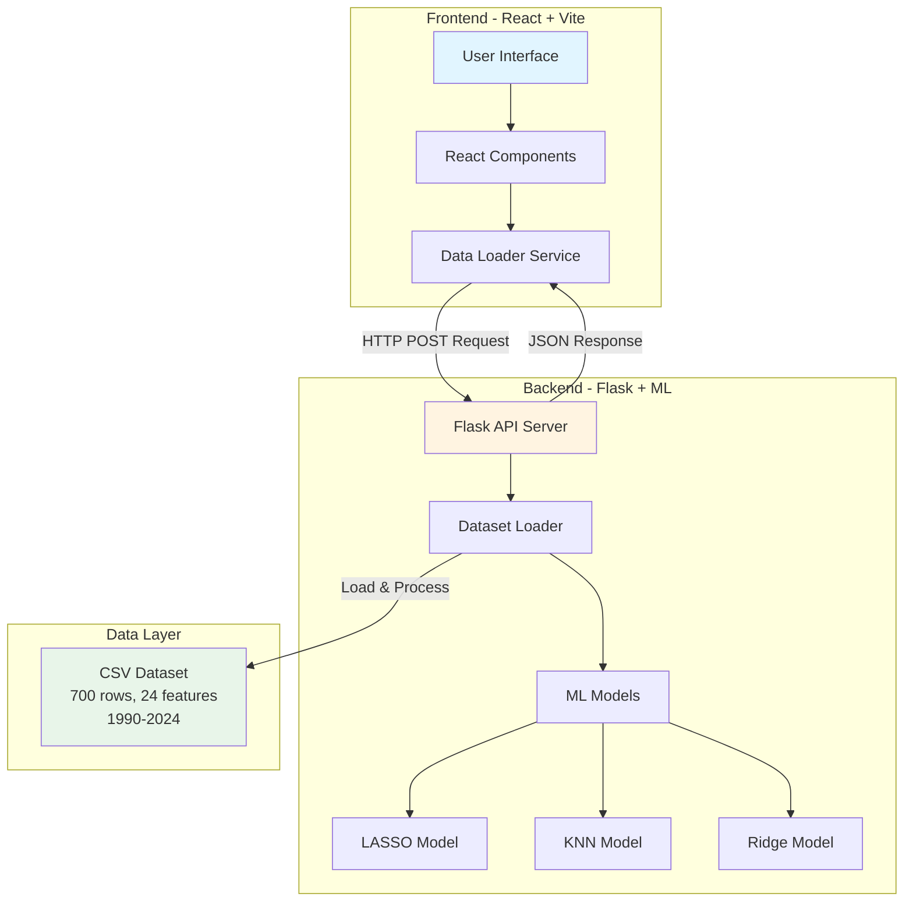
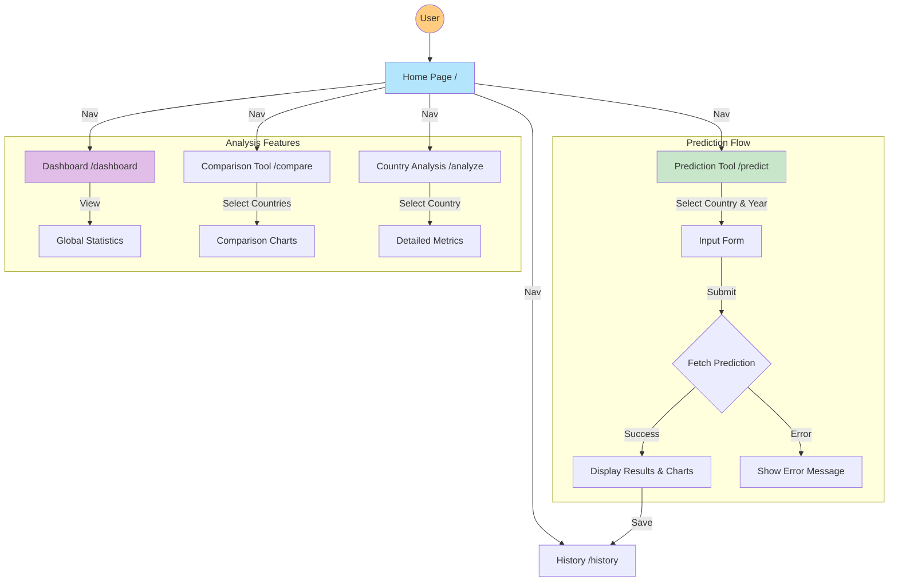
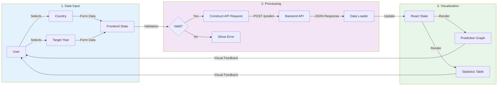
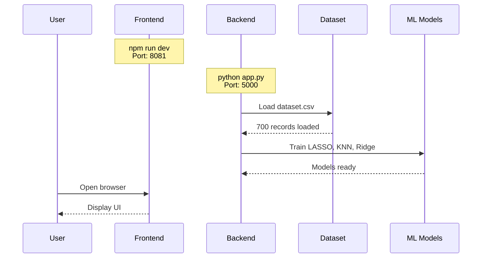
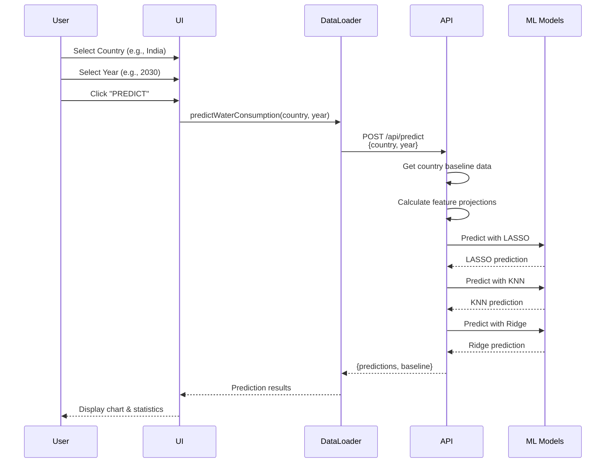
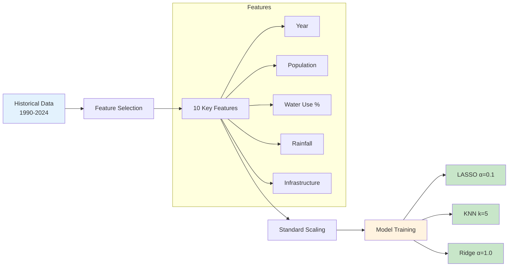
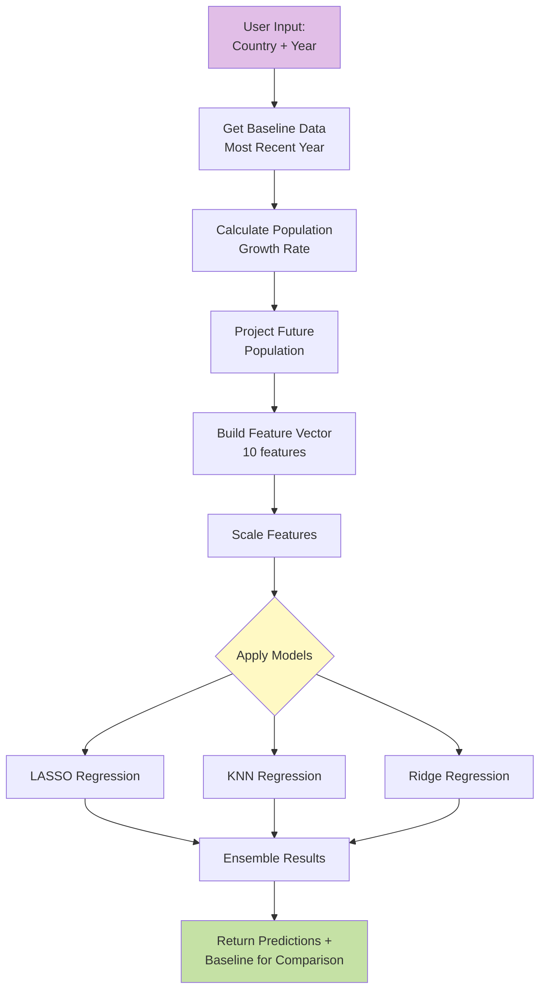

# Water Consumption Forecasting - Project Workflow

This document provides a comprehensive workflow overview for PPT presentations.

---

## System Architecture



---

## Frontend User Interaction Workflow

This block diagram illustrates how users navigate and interact with the application.



---

### Frontend Data Flow (User Perspective)

This diagram focuses on how data moves from the user through the system and back, suitable for explaining the "Input-Process-Output" cycle in a presentation.



---

```

### Key Data Flow Topics for Presentation

When presenting the data flow, consider covering these key technical points:

1.  **Input Validation & Sanitization**
    *   *Frontend*: Ensuring "Target Year" is within valid range (2025-2035).
    *   *Backend*: Verifying country existence in the dataset before processing.

2.  **Asynchronous API Communication**
    *   Using `fetch` with `await` to prevent UI freezing during model inference.
    *   JSON payload structure: `{"country": "India", "year": 2030}`.

3.  **Real-time Feature Engineering**
    *   The backend doesn't just look up values; it *calculates* them.
    *   *Lag Features*: Using past 3 years' data to predict the next.
    *   *Growth Projections*: Applying population growth rates to future years.

4.  **Model Ensemble Logic**
    *   Running three distinct models (LASSO, KNN, Ridge) in parallel.
    *   Comparing results to ensure consistency (Variance check).

5.  **State Management**
    *   How React state updates trigger re-rendering of the Recharts graph.
    *   Separation of "Loading", "Success", and "Error" states for better UX.

---

## Data Flow Workflow

### 1. Application Startup



### 2. Prediction Request Flow



---

## Machine Learning Pipeline

### Feature Engineering Process



### Prediction Generation



---

## Key Features & Technologies

### Frontend Stack
- **Framework**: React 18 + TypeScript
- **Build Tool**: Vite
- **UI Library**: Radix UI + Tailwind CSS
- **Charts**: Recharts
- **Data Parsing**: PapaParse

### Backend Stack
- **Framework**: Flask 3.0
- **ML Library**: scikit-learn 1.3.2
- **Data Processing**: pandas 2.1.4, numpy 1.26.2
- **CORS**: flask-cors 4.0

### Dataset Features (24 columns)
1. Year (1990-2024)
2. Country & Country Code
3. Population
4. Total Water Consumption (BCM)
5. Per Capita Water Use
6. Agricultural Water Use (%)
7. Industrial Water Use (%)
8. Household Water Use (%)
9. Rainfall Impact (mm)
10. Groundwater Depletion Rate (%)
11. Water Scarcity Level
12. Number of Dams
13. Reservoir Capacity
14. Number of Industries
15. ISO Code
16-24. Engineered Features (lag, moving averages, interactions)

---

## Model Comparison

| Model | Algorithm | Hyperparameters | Use Case |
|-------|-----------|-----------------|----------|
| **LASSO** | Linear Regression with L1 regularization | α = 0.1 | Feature selection, handles multicollinearity |
| **KNN** | K-Nearest Neighbors | k = 5, distance-weighted | Non-linear patterns, local trends |
| **Ridge** | Linear Regression with L2 regularization | α = 1.0 | Stable predictions, handles correlated features |

---

## API Endpoints

### POST `/api/predict`

**Request:**
```json
{
  "country": "India",
  "year": 2030
}
```

**Response:**
```json
{
  "predictions": {
    "lasso": 1261.77,
    "knn": 1260.44,
    "ridge": 1260.24
  },
  "baseline": {
    "year": 2024,
    "consumption": 1017.25
  }
}
```

### GET `/health`

**Response:**
```json
{
  "status": "healthy",
  "models_loaded": true,
  "dataset_loaded": true
}
```

---

## Deployment & Running

### Development Setup

```bash
# Frontend (Terminal 1)
npm install
npm run dev
# Runs on: http://localhost:8081

# Backend (Terminal 2)
.\venv\Scripts\Activate.ps1
cd backend
pip install -r requirements.txt
python app.py
# Runs on: http://localhost:5000
```

### Project Structure

```
MajorProject(Latest)/
├── frontend/
│   ├── src/
│   │   ├── pages/
│   │   │   ├── Home.tsx
│   │   │   ├── Predict.tsx
│   │   │   ├── Dashboard.tsx
│   │   │   └── Compare.tsx
│   │   ├── lib/
│   │   │   └── dataLoader.ts
│   │   └── components/
│   ├── public/
│   │   └── data/
│   │       └── dataset.csv
│   └── package.json
│
├── backend/
│   ├── app.py
│   ├── requirements.txt
│   └── logs/
│
└── venv/
```

---

## Results & Performance

### Sample Prediction: India 2030

| Metric | Value |
|--------|-------|
| **Baseline (2024)** | 1017.25 BCM |
| **LASSO Prediction** | 1261.77 BCM (+24.0%) |
| **KNN Prediction** | 1260.44 BCM (+23.9%) |
| **Ridge Prediction** | 1260.24 BCM (+23.9%) |
| **Average Growth** | ~24% over 6 years |

### Model Agreement
All three models show strong agreement (variance < 0.2%), indicating robust predictions.

---

## Future Enhancements

1. **Model Improvements**
   - Ensemble methods (Random Forest, Gradient Boosting)
   - Time series models (ARIMA, LSTM)
   - Cross-validation for better accuracy

2. **Features**
   - Climate change impact factors
   - Policy intervention scenarios
   - Water conservation metrics

3. **Deployment**
   - Docker containerization
   - Cloud deployment (AWS/Azure)
   - CI/CD pipeline

---

## Conclusion

This project demonstrates a full-stack ML application for water consumption forecasting, combining:
- Modern web technologies (React, TypeScript, Vite)
- Machine learning models (LASSO, KNN, Ridge)
- RESTful API architecture
- Interactive data visualization
- Real-world environmental data analysis
